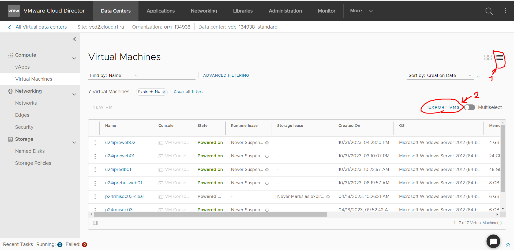
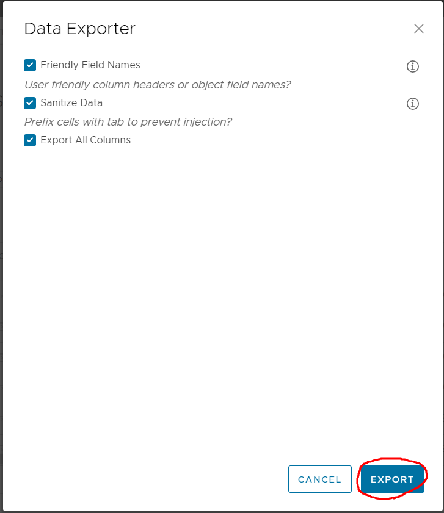
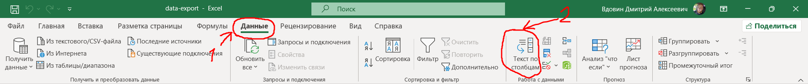
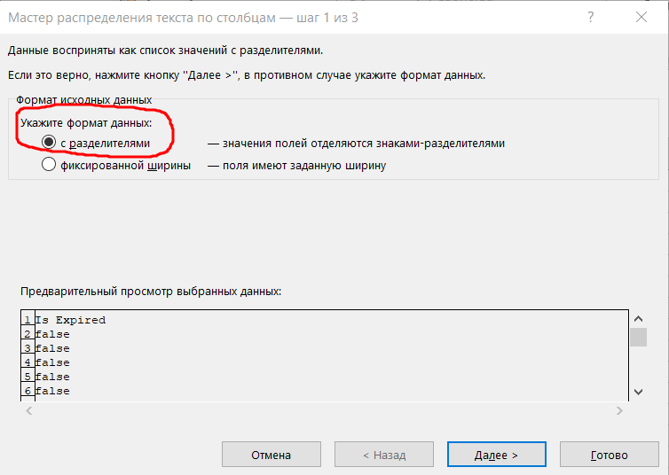
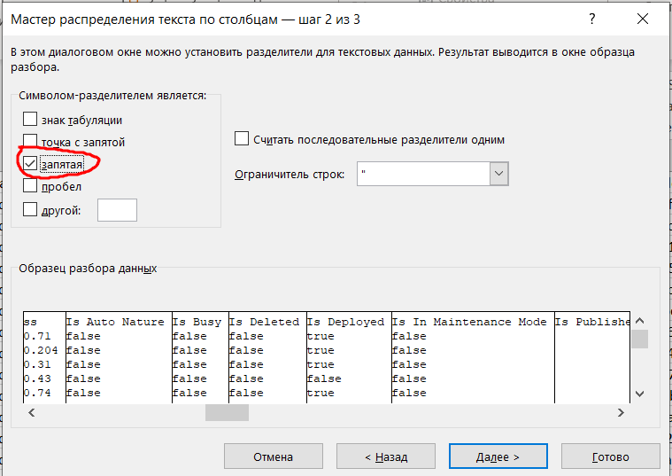
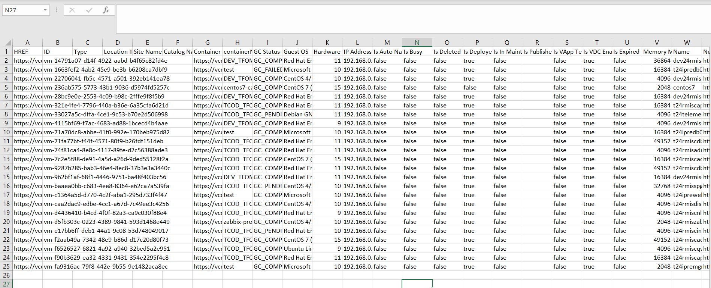
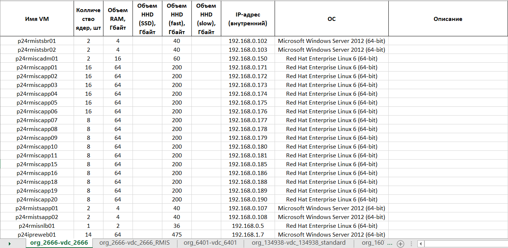

# Для чего этот скрипт
Данный скрипт разработан для предоставления информации из VMware Cloud Director, а конкретно для инвентаризации виртуальных машин, с помощью редактирования импортируемого csv файла.

# Перед началом работы
Для того, чтобы начать работу с данным скриптом вам необходимо:
    
  1. Установить все зависиомсти из файла requirements.txt. Для этого вы можете использовать команду находясь в корне проекта.

    pip install -r requirements.txt

  2. Скачать информацию по виртуальным машинам в файле csv.

  3. После скачивания файла открыть его и преобразовать текст по столбцам. Для этого откройте файл, выделите все ячейки столбца А. Далее в верхнем меню переходим в "Данные", выбираем "Текст по столбцам".

  4. В открывшемся окне на 1 шаге необходимо выбрать "С разделителями" и нажать далее.

  5. В следующем окне необходимо выбрать "Запятая" и убедиться, что образец разбора данных совпадает с приведенным на изображении ниже, образцом.

  6. Нажать "Готово". В открывшемся окне необходимо убедиться, что была получена следующая структура файла.

  7. Если структура совпадает с приведенной выше, то в таком случае необходимо сохранить файл по пути **./excel/** с именем **data-export.xlsx**. Вы можете изменить это имя в переменной "input_file" в файле **./app/config.py**.

  8. Создайте файл Excel по пути **./excel/** с именем **data-import.xlsx**. 
> [!CAUTION]
> Скрипт вносит информацию в тот лист, который последний раз был открыт и остался активным. Для выбора листа внесения информации, необходимо открыть фалй **data-import.xlsx**, выбрать нужный лист и нажать "Сохранить".

  9. После проведения всех манипуляций указанных выше, можно запустить скрипт. В результате работы скрипта вы должны получить следующий файл.

# Какую информацию собирает скрипт?
Скрипт собирает следующую информацию:

 - Имя виртуальной машины;

 - Количество ядер;

 - Объем RAM;

 - Объем памяти и её тип (в зависимости от памяти, вносит информацию по нужным столбцам);

 - Внутренний IP-адрес;

 - Информацию о установленной ОС.
